# 🌊 System Data Flow Architecture

This document details the end-to-end lifecycle of telemetry data within **FleetTracker**, tracing the path from a moving vehicle to the operator's dashboard.

## 🗺 High-Level Map

```mermaid
sequenceDiagram
    participant Car as 🚗 Python Simulator
    participant MQTT as 📡 Mosquitto (MQTT)
    participant Ingest as 🛡️ Go Ingestor
    participant Kafka as 📨 Apache Kafka
    participant Process as ⚙️ Go Processor
    participant DB as 💾 TimescaleDB
    participant UI as 🖥️ Next.js Dashboard

    Note over Car, MQTT: Edge Layer (Unreliable Network)
    Car->>MQTT: Publish JSON (Topic: telemetry/+)

    Note over MQTT, Ingest: Ingestion Layer
    MQTT->>Ingest: Push Message
    Ingest->>Ingest: Validate & Convert to Protobuf

    Note over Ingest, Kafka: Streaming Layer
    Ingest->>Kafka: Produce Binary Event

    Note over Kafka, Process: Processing Layer
    Process->>Kafka: Consume Batch (500 msgs)

    par Persistence
        Process->>DB: Bulk Insert (SQL)
    and Real-Time
        Process->>UI: Push Update (WebSocket)
    end
```

