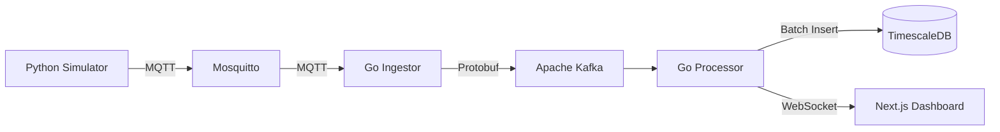

reSQL.

Hypertables: Automatically partitions data by time, ensuring queries remain fast even as the dataset grows to billions of rows.

Data Retention: Native support for policies to automatically drop raw data after X days and keep downsampled aggregates (1-minute or 1-hour averages).

6. Data Serialization: Protocol Buffers (Protobuf)
   Role: The schema definition language for all data moving through the system.

Why we chose it:

Type Safety: Acts as the "Universal Translator" between Python (Sim), Go (Backend), and TypeScript (Frontend), preventing schema drift errors.

Compactness: Serializes data into binary, reducing payload size by ~4x compared to JSON, which significantly reduces network costs and Kafka storage requirements.

🖥 Frontend & Visualization 7. Framework: Next.js (React)
Role: The operator dashboard for fleet managers.

Why we chose it:

Hybrid Rendering: Uses Server-Side Rendering (SSR) for fast initial load and SEO, combined with Client-Side Rendering for the real-time map interface.

Ecosystem: Seamless integration with TypeScript and Vercel's tooling.

8. Visualization: Deck.gl
   Role: High-performance WebGL-powered map overlays.

Why we chose it:

WebGL Rendering: Unlike Leaflet or standard Google Maps markers (which are DOM nodes), Deck.gl renders points on the GPU. This allows us to visualize 100,000+ moving vehicles smoothly at 60fps.

🛠 Infrastructure & Tooling 9. Monorepo (Managed manually/Docker Compose)
Role: Code organization strategy.

Why we chose it:

Atomic Commits: Allows us to update the .proto definition and the dependent Go/TS services in a single Pull Request.

Developer Experience: One docker compose up command spins up the entire distributed system (Kafka, DB, Backend, Frontend) locally.

10. Simulation: Python
    Role: Traffic generation and physics simulation.

Why we chose it:

Rich Libraries: Easy access to math/physics libraries to simulate realistic driving behaviors, latency jitter, and erratic connection patterns.# Tech Stack & Architecture Decisions

This document outlines the technology choices for **FleetTracker**, a high-performance distributed system designed to ingest, process, and visualize real-time automotive telemetry data at scale.

## 🏗 High-Level Architecture

The system follows an **Event-Driven Microservices** architecture, optimized for high write throughput and real-time data visualization.

🚀 Core Technologies

1. Backend Services: Go (Golang)
   Role: High-throughput data ingestion and stream processing.

Why we chose it:

Concurrency: Go's lightweight Goroutines allow us to handle 10k+ concurrent MQTT connections per node with minimal RAM footprint compared to Node.js or Python.

Performance: Compiled to machine code, offering low-latency processing critical for real-time alerts (e.g., crash detection).

Simplicity: Strong standard library for networking and concurrency without the complexity of C++ or Rust.

2. Communication Protocol: MQTT v5
   Role: Edge-to-Cloud communication protocol between vehicles and the ingestion layer.

Why we chose it:

Low Overhead: Extremely lightweight binary header (2 bytes min) compared to HTTP's verbose text headers, saving massive bandwidth for cellular IoT devices.

Reliability: Supports QoS (Quality of Service) levels to guarantee message delivery even over unstable 2G/3G networks.

Pub/Sub Model: Decouples the vehicle from the backend; the car doesn't need to know who is listening.

3. Message Broker: Eclipse Mosquitto
   Role: The MQTT Broker acting as the entry point for all telemetry data.

Why we chose it:

Industry Standard: Lightweight, open-source C implementation that is battle-tested for IoT workloads.

Resource Efficiency: Capable of handling thousands of active connections on minimal hardware.

4. Event Streaming: Apache Kafka
   Role: Asynchronous data buffer between the Ingestion Service and the Database/Analytics layers.

Why we chose it:

Throttling & Backpressure: Acts as a "shock absorber." If the database slows down during a maintenance window, data piles up safely in Kafka instead of crashing the ingestion servers.

Replayability: Allows us to replay historical event streams to test new services or debug crash incidents.

5. Database: TimescaleDB
   Role: Persistent storage for time-series telemetry data.

Why we chose it:

Best of Both Worlds: It provides the raw insert speed of a NoSQL database with the reliability and SQL interface of Postg
