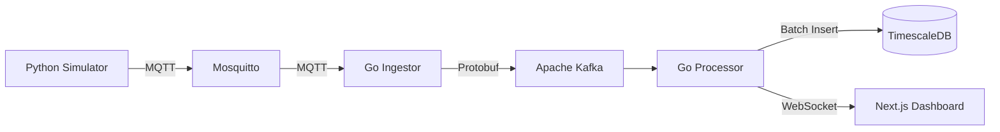

# Tech Stack & Architecture Decisions

This document outlines the technology choices for **FleetTracker**, a high-performance distributed system designed to ingest, process, and visualize real-time automotive telemetry data at scale.

## 🏗 High-Level Architecture

The system follows an **Event-Driven Microservices** architecture, optimized for high write throughput and real-time data visualization.

